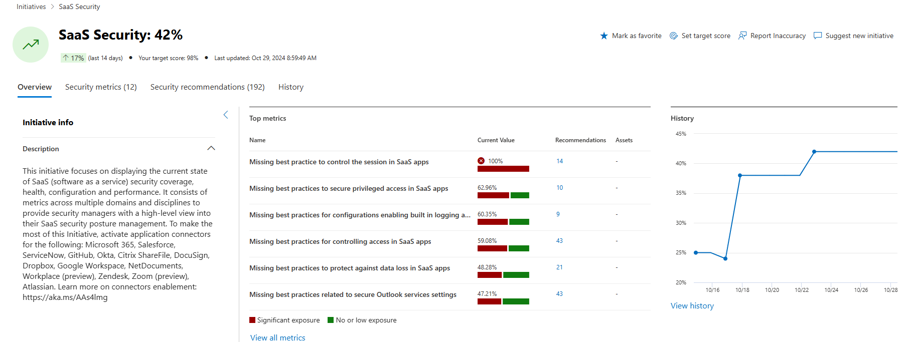
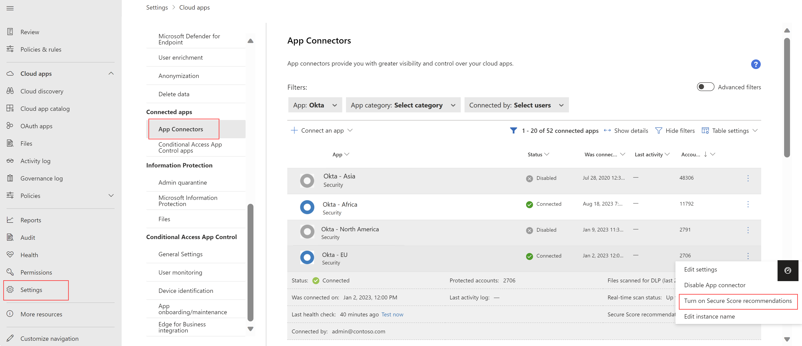

# SaaS security posture management (SSPM) - overview

> [!NOTE]
> Microsoft Security Exposure Management data and capabilities are currently unavailable in U.S Government clouds - GCC, GCC High and DoD. For these environments, it is recommended to consume SaaS security posture recommendations via [Microsoft Secure Score](/microsoft-365/security/defender-endpoint/tvm-security-recommendation).

One of Microsoft Defender for Cloud Apps’ core pillars is SaaS Security Posture Management (SSPM), which offers detailed visibility into the security state of your SaaS applications and provides actionable guidance to help you strengthen your security posture efficiently. Your SaaS application environments might be configured with a risky posture, and Defender for Cloud Apps provides risk-based security configuration assessments to help you identify and mitigate potential risks. These recommendations are shown in [Microsoft Security Exposure Management](/security-exposure-management/microsoft-security-exposure-management) once you have a connector to an application. For example:

## Prerequisites

- Your organization must have Microsoft Defender for Cloud Apps licenses.
- Your app must be connected to Defender for Cloud Apps. For more information, see:
  - [Connect apps to get visibility and control with Microsoft Defender for Cloud Apps](enable-instant-visibility-protection-and-governance-actions-for-your-apps.md)
  - [Learn which of the apps connectors provides security recommendations ](enable-instant-visibility-protection-and-governance-actions-for-your-apps.md#user-app-governance-and-security-configuration-visibility)

## Turn on SaaS security recommendations

Follow these steps to ensure that your application connector is set to show data in Microsoft Security Exposure Management.

1. In Microsoft Defender XDR, select **Settings** > **Cloud Apps** > **Connected apps** > **App Connectors**.

1. Use the filter to locate the application where you want to turn on security recommendations.

1. Open the instance drawer and note whether 'Security recommendations' are turned on or off. For example, the following example shows that 'Security recommendations' are turned on for **Okta Contoso EU** instance:

   

   If the instance is currently set to **Off**, select the **...** options menu and then select **Turn on 'Security recommendations'**. For example:

   

   > [!NOTE]
   > If you have multiple instances of the same app, you can send security recommendations for each instance separately.
   > Security recommendations for the selected instance are added to Microsoft Security Exposure Management in addition to the current recommendations.

Security recommendations are shown automatically in [Microsoft Security Exposure Management](/microsoft-365/security/defender/microsoft-secure-score). Recommendations are based on Microsoft benchmarks, and might take up to 24 hours to update.

In Microsoft Secure Score, filter the **Recommended actions** tab by product to view any recommended actions. If you have multiple instances of an app, you can select to filter recommendations from specific instances only. For example:

:::image type="content" source="media/secure-score-filter.png" alt-text="Screenshot of a Secure Score filter showing multiple instances of an app.":::

Select a recommendation and then select the **Implementation** tab in the details pane for a step-by-step remediation guide.

For more information, see [Assess your security posture with Microsoft Secure Score](/microsoft-365/security/defender/microsoft-secure-score-improvement-actions).

## How to manage your organization SaaS security posture

> [!IMPORTANT]
> Since Microsoft Security Exposure Management data and capabilities are currently unavailable in U.S Government clouds - GCC, GCC High and DoD, it is recommended for these environments to consume SaaS security posture recommendations in [Microsoft Secure Score](/microsoft-365/security/defender-endpoint/tvm-security-recommendation) as explained above.

To effectively manage your organization's SaaS security posture, we recommend beginning with the SaaS Security initiative. This initiative consolidates best practices and measurable metrics specifically for securing SaaS applications, allowing you to prioritize and address the most impactful recommendations for SaaS environments. For more information, see [SaaS Security Initiative](/defender-cloud-apps/saas-security-initiative).

In addition you can find a variety of SSPM recommendations under different initiatives. Key initiatives include:

- SaaS Security
- CIS Microsoft 365 Foundations Benchmark
- Ransomware Protection
- Identity Security
- Business Email Compromise - Financial fraud
- Zero Trust (Foundational)

## Next steps

> [!div class="nextstepaction"]
> [Control cloud apps with policies](control-cloud-apps-with-policies.md)

[!INCLUDE [Open support ticket](includes/support.md)]
