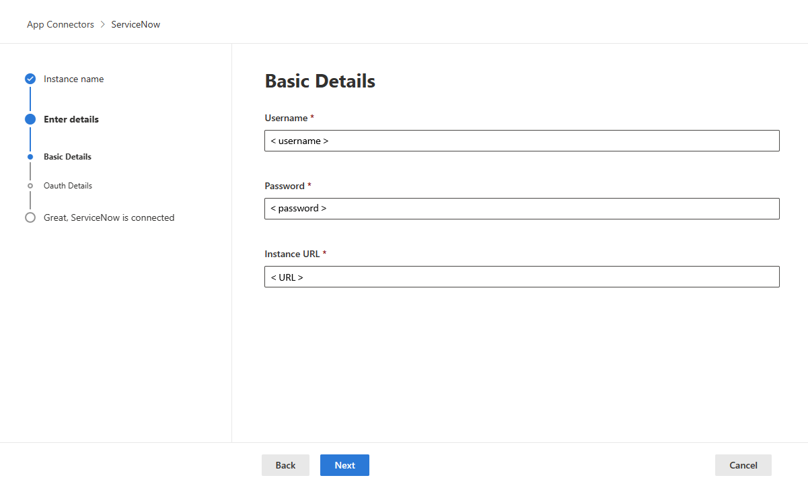
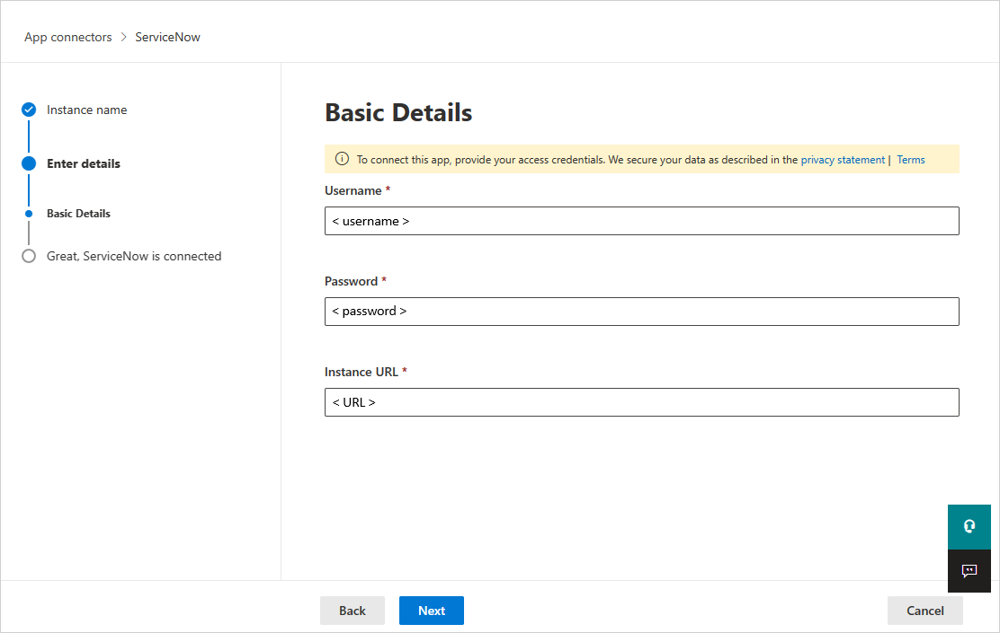

# How Defender for Cloud Apps helps protect your ServiceNow environment

As a major CRM cloud provider, ServiceNow incorporates large amounts of sensitive information about customers, internal processes, incidents, and reports inside your organization. Being a business-critical app, ServiceNow is accessed and used by people inside your organization and by others outside of it (such as partners and contractors) for various purposes. In many cases, a large proportion of your users accessing ServiceNow have low awareness of security and might put your sensitive information at risk by unintentionally sharing it. In other instances, malicious actors may gain access to your most sensitive customer-related assets.

Connecting ServiceNow to Defender for Cloud Apps gives you improved insights into your users' activities, provides threat detection using machine learning based anomaly detections, and information protection detections such as identifying when sensitive customer information is uploaded to the ServiceNow cloud.

[!INCLUDE [security-posture-management-connector](includes/security-posture-management-connector.md)]

## Main threats

- Compromised accounts and insider threats
- Data leakage
- Insufficient security awareness
- Unmanaged bring your own device (BYOD)

## How Defender for Cloud Apps helps to protect your environment

- [Detect cloud threats, compromised accounts, and malicious insiders](best-practices.md#detect-cloud-threats-compromised-accounts-malicious-insiders-and-ransomware)
- [Discover, classify, label, and protect regulated and sensitive data stored in the cloud](best-practices.md#discover-classify-label-and-protect-regulated-and-sensitive-data-stored-in-the-cloud)
- [Enforce DLP and compliance policies for data stored in the cloud](best-practices.md#enforce-dlp-and-compliance-policies-for-data-stored-in-the-cloud)
- [Limit exposure of shared data and enforce collaboration policies](best-practices.md#limit-exposure-of-shared-data-and-enforce-collaboration-policies)
- [Use the audit trail of activities for forensic investigations](best-practices.md#use-the-audit-trail-of-activities-for-forensic-investigations)

## SaaS security posture management

[
Connect ServiceNow](#connect-servicenow-to-microsoft-defender-for-cloud-apps) to automatically get security recommendations for ServiceNow in Microsoft Secure Score.

In Secure Score, select **Recommended actions** and filter by **Product** = **ServiceNow**. For example, recommendations for ServiceNow include:

- *Enable MFA*
- *Activate the explicit role plugin*
- *Enable high security plugin*
- *Enable script request authorization*

For more information, see:
-	[Security posture management for SaaS apps](security-saas.md)
-	[Microsoft Secure Score](/microsoft-365/security/defender/microsoft-secure-score)

## Control ServiceNow with built-in policies and policy templates

You can use the following built-in policy templates to detect and notify you about potential threats:

| Type | Name |
| ---- | ---- |
| Built-in anomaly detection policy | [Activity from anonymous IP addresses](anomaly-detection-policy.md#activity-from-anonymous-ip-addresses) [Activity from infrequent country](anomaly-detection-policy.md#activity-from-infrequent-country) 
[Activity from suspicious IP addresses](anomaly-detection-policy.md#activity-from-suspicious-ip-addresses) [Impossible travel](anomaly-detection-policy.md#impossible-travel) [Activity performed by terminated user](anomaly-detection-policy.md#activity-performed-by-terminated-user) (requires Microsoft Entra ID as IdP) [Multiple failed login attempts](anomaly-detection-policy.md#multiple-failed-login-attempts) [Ransomware detection](anomaly-detection-policy.md#ransomware-activity) [Unusual multiple file download activities](anomaly-detection-policy.md#unusual-activities-by-user) |
| Activity policy template | Logon from a risky IP address Mass download by a single user|
| File policy template | Detect a file shared with an unauthorized domain Detect a file shared with personal email addresses Detect files with PII/PCI/PHI |

For more information about creating policies, see [Create a policy](control-cloud-apps-with-policies.md#create-a-policy).

## Automate governance controls

In addition to monitoring for potential threats, you can apply and automate the following ServiceNow governance actions to remediate detected threats:

| Type | Action |
| ---- | ---- |
| User governance | - Notify user on alert (via Microsoft Entra ID) - Require user to sign in again (via Microsoft Entra ID) - Suspend user (via Microsoft Entra ID) |

For more information about remediating threats from apps, see [Governing connected apps](governance-actions.md).

## Protect ServiceNow in real time

Review our best practices for [securing and collaborating with external users](best-practices.md#secure-collaboration-with-external-users-by-enforcing-real-time-session-controls) and [blocking and protecting the download of sensitive data to unmanaged or risky devices](best-practices.md#block-and-protect-download-of-sensitive-data-to-unmanaged-or-risky-devices).

## Connect ServiceNow to Microsoft Defender for Cloud Apps

This article provides instructions for connecting Microsoft Defender for Cloud Apps to your existing ServiceNow account using the app connector API. This connection gives you visibility into and control over ServiceNow use. For information about how Defender for Cloud Apps protects ServiceNow, see [Protect ServiceNow](protect-servicenow.md).

[!INCLUDE [security-posture-management-connector](includes/security-posture-management-connector.md)]

### Prerequisites

Defender for Cloud Apps supports the following ServiceNow versions:

:::row:::
    :::column:::
        - Eureka
        - Fiji
        - Geneva
        - Helsinki
        - Istanbul
        - Jakarta
        - Kingston
        - London  
        - Utah
    :::column-end:::
    :::column:::
        - Madrid
        - New York
        - Orlando
        - Paris
        - Quebec
        - Rome
        - San Diego
        - Tokyo    
        - Vancouver
        - Washington
        - Xanadu
    :::column-end:::
:::row-end:::

In order to connect ServiceNow with Defender for Cloud Apps, you must have the **Admin** role and make sure the ServiceNow instance supports API access. 

For more information, see the [ServiceNow product documentation](https://docs.servicenow.com/bundle/paris-platform-administration/page/administer/security/concept/c_OAuthApplications.html#c_OAuthApplications).

> [!TIP]
> We recommend deploying ServiceNow  using OAuth app tokens, available for Fuji and later releases. For more information, see the relevant [ServiceNow documentation](https://docs.servicenow.com/bundle/paris-platform-administration/page/administer/security/concept/c_OAuthApplications.html#c_OAuthApplications).
>
> For earlier releases, a [legacy connection mode](#legacy-servicenow-connection) is available based on user/password. The username/password provided are only used for API token generation and are not saved after the initial connection process.
>

### How to connect ServiceNow to Defender for Cloud Apps using OAuth

1. Sign in with an Admin account to your ServiceNow account.

   > [!NOTE]
   > The username/password provided are only used for API token generation and are not saved after the initial connection process.
1. In the **Filter navigator** search bar, type **OAuth** and select **Application Registry**.

1. In the **Application Registries** menu bar, select **New** to create a new OAuth profile.
1. Under **What kind of OAuth application?**, select **Create an OAuth API endpoint for external clients**.
1. Under **Application Registries New record** fill in the following fields:
   - **Name** field, name the new OAuth profile, for example, CloudAppSecurity.
      
   - The **Client ID** is generated automatically. Copy this ID, you need to paste it into Defender for Cloud Apps to complete connection.
      
   - In the **Client Secret** field, enter a string. If left empty, a random Secret is generated automatically. Copy and save it for later.
      
   - Increase the **Access Token Lifespan** to at least 3,600.
      
   - Select **Submit**.
1. Update the lifespan of the refresh token:

   1. On the **ServiceNow** pane, search for **System OAuth**, and then select **Application Registry**.
   
   1. Select the name of the OAuth that was defined, and change **Refresh Token Lifespan** to **7,776,000 seconds** (90 days).
   
   1. Select **Update**.
   
1. Establish an internal procedure to ensure that the connection remains alive. A couple of days before the expected expiration of the refresh token lifespan.
Revoke to the old refresh token. We don't recommend keeping old keys for security reasons.

    1. On the ServiceNow pane, search for **System OAuth**, and then select **Manage Tokens**.

    1. Select the old token from the list according to the OAuth name and expiration date.

    1. Select **Revoke Access > Revoke**.
      
1. In the Microsoft Defender Portal, select **Settings**. Then choose **Cloud Apps**. Under **Connected apps**, select **App Connectors**.

1. In the **App connectors** page, select **+Connect an app**, and then **ServiceNow**.

    
   
1. In the next window, give the connection a name and select **Next**.
1. In the **Enter details** page, select **Connect using OAuth token (recommended)**. Select **Next**.

1. In the **Basic Details** page, add your ServiceNow user ID, password, and instance URL in the appropriate boxes. Select **Next**.

    
   
   - To find your ServiceNow User ID, in the ServiceNow portal, go to **Users** and then locate your name in the table.
   
     
     
1. In the **OAuth Details** page, enter your **Client ID** and **Client Secret**. Select **Next**.

1. In the Microsoft Defender Portal, select **Settings**. Then choose **Cloud Apps**. Under **Connected apps**, select **App Connectors**. Make sure the status of the connected App Connector is **Connected**.

After connecting ServiceNow, you'll receive events for seven days prior to connection.

### Legacy ServiceNow connection

To connect ServiceNow with Defender for Cloud Apps, you must have admin-level permissions and make sure the ServiceNow instance supports API access.

1. Sign in with an Admin account to your ServiceNow account.

1. Create a new service account for Defender for Cloud Apps and attach the Admin role to the newly created account.

1. Make sure the REST API plug-in is turned on.

    
   
1. In the Microsoft Defender Portal, select **Settings**. Then choose **Cloud Apps**. Under **Connected apps**, select **App Connectors**.

1. In the **App connectors** page, select **+Connect an app**, and then **ServiceNow**.

   
   
1. In the next window, give the connection a name and select **Next**.
1. In the **Enter details** page, select **Connect using username and password only**. Select **Next**.

1. In the **Basic Details** page, add your ServiceNow user ID, password, and instance URL in the appropriate boxes. Select **Next**.

    
   
1. Select **Connect**.
1. In the Microsoft Defender Portal, select **Settings**. Then choose **Cloud Apps**. Under **Connected apps**, select **App Connectors**. Make sure the status of the connected App Connector is **Connected**.
After connecting ServiceNow, you'll receive events for one hour prior to connection.

If you have any problems connecting the app, see [Troubleshooting App Connectors](troubleshooting-api-connectors-using-error-messages.md).

## Next steps

> [!div class="nextstepaction"]
> [Control cloud apps with policies](control-cloud-apps-with-policies.md)

[!INCLUDE [Open support ticket](includes/support.md)]

